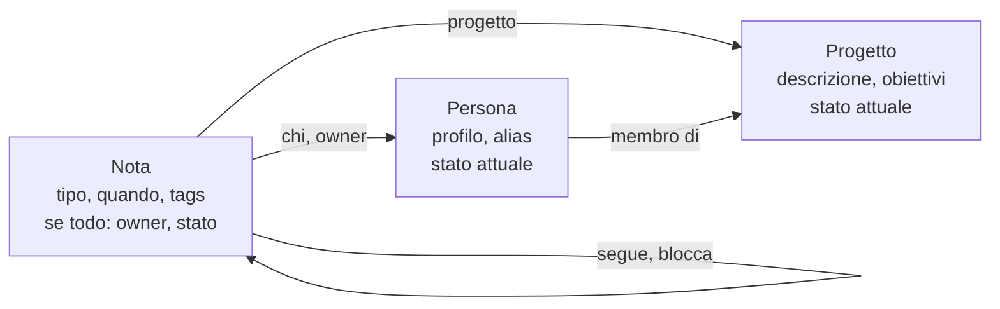
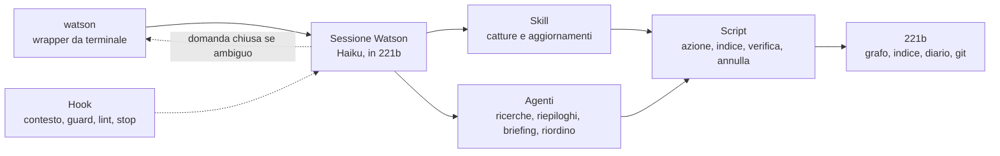

# Watson — Specifica di prodotto

Versione: 0.2 · Stato: base di partenza

> **Come evolve questo documento.** `SPEC.md` descrive sempre come Watson funziona *oggi*: Eevee lo aggiorna sul posto quando una proposta viene applicata. Il *perché* di ogni cambiamento vive nelle proposte in `evoluzioni/`, una per file, e `CHANGELOG.md` collega ogni versione alle proposte che l'hanno prodotta. Le idee grezze nascono nel repository `221b` e diventano proposte qui solo in forma generica, senza nomi reali.

## Visione

Watson è un assistente da terminale per tech lead: scrivi un appunto in linguaggio naturale, Watson lo collega a persone e progetti e lo rende interrogabile in seguito.

**Il nome.** Come il dottor Watson tiene i taccuini di Sherlock Holmes e ricorda ogni dettaglio dei casi, Watson tiene gli appunti del tech lead e li ritrova quando servono. E quando serve indagare, chiama `sherlock`.

**Il problema.** Le note di un tech lead riguardano tre cose diverse: una persona, una persona su un progetto, un progetto. Le cartelle costringono a scegliere un solo posto, e tanti comandi separati aggiungono attrito proprio quando serve velocità.

**Per chi.** Un tech lead che segue più progetti con team piccoli. Per esempio due progetti, Alpha (anna, luca, davide, sara) e Beta (marco, elena, paolo, chiara).

**Come sappiamo che funziona.**

- Un appunto si cattura in meno di 10 secondi dal momento in cui ci pensi.
- Nessun appunto va mai perso, nemmeno quando Watson sbaglia o viene interrotto.
- Un 1:1 o un meeting di progetto si prepara con un solo comando.

## Principi

Sette regole che valgono per ogni funzionalità; quando due entrano in conflitto, vince quella più in alto.

1. **Nessuna nota persa.** Se Watson non capisce, sbaglia o viene interrotto, il testo finisce comunque salvato, al peggio come bozza in inbox.
2. **Dati sempre consistenti.** Nel grafo entra solo ciò che rispetta tutte le invarianti. Ciò che non è valido non si perde: aspetta in inbox, che sta fuori dal grafo. Watson non introduce mai un'incoerenza, e quelle che trova le rende visibili subito.
3. **Nel dubbio, chiedi.** Watson si ferma solo se due interpretazioni sono plausibili e portano a risultati diversi. Le domande sono chiuse, con le opzioni pronte.
4. **Dichiara cosa hai fatto.** Ogni esecuzione si chiude con un resoconto dell'azione eseguita, così un errore si vede subito.
5. **Tutto si annulla.** Qualsiasi azione si annulla con un comando. È la rete che permette di non chiedere conferme.
6. **Il testo è la fonte di verità.** Tutto vive in file markdown leggibili e modificabili a mano, senza database.
7. **Watson impara, in modo trasparente.** Ciò che Watson deduce dalle risposte dell'utente è scritto in un file che si può leggere e correggere.

## Interfaccia

Watson ha un solo comando, `watson`, e capisce da solo cosa vuoi fare.

```
watson su alpha oggi luca ha sbagliato un rilascio
watson cosa è successo questa settimana su alpha
watson e su beta?
watson prepara il mio 1:1 con marco
watson annulla
```

**Due modalità.**

- `watson <frase>` esegue e si chiude. Resta aperto solo se deve farti una domanda, e si chiude appena hai risposto.
- `watson` senza argomenti apre una sessione, per le attività lunghe: preparare un 1:1, la revisione della settimana, riordinare, far evolvere Watson.

**Continuità.** Un comando lanciato entro 10 minuti dal precedente riprende la stessa sessione, così `watson e su beta?` ha senso dopo una domanda su Alpha. Oltre quella finestra ogni comando parte da zero. `watson nuovo` forza una sessione nuova. Data e ora correnti vengono aggiunte automaticamente a ogni messaggio.

**Forzare l'intenzione.** Un prefisso scavalca il riconoscimento automatico: `watson nota: ...`, `watson todo: ...`, `watson cerca: ...`. Serve di rado, quando Watson sbaglia sempre su un certo tipo di frase.

**Resoconto.** Ogni esecuzione si chiude con un resoconto breve di cosa è stato fatto, una riga per azione, senza divagare.

```
📸 Memento · Polaroid scattata: "Rilascio fallito" · incidente, per luca su alpha
📋 Monica · In lista: "Stima refactor" · per luca, entro venerdì 9 ottobre
✅ Monica · Spuntato: "Stima refactor" di luca
🤝 Fellowship · Benvenuta nella compagnia: giulia · alpha
⚡ DeLorean · Grande Giove! Annullata "Rilascio fallito"
```

- **Sempre:** l'azione e il titolo della nota, del todo o dell'entità toccata.
- **Solo se informativo:** tipo, per chi, dove, scadenza. Watson li aggiunge quando li ha dedotti e non erano ovvi dalla frase: il progetto ricavato dalla persona, una data relativa risolta, un owner delegato, una persona appena aggiunta.
- **Mai:** dettagli tecnici che avvengono sempre, come commit, indice, diario o percorsi dei file. Si vedono solo se li chiedi.
- **Azioni composte:** una riga per azione, nell'ordine in cui sono state eseguite.
- **Interrogazioni:** la risposta stessa, chiusa da una riga con le fonti.
- **Apprendimento:** se Watson ha imparato una preferenza, un'ultima riga "Ho imparato: ...".

**Avanzamento.** Mentre `watson <frase>` lavora, il terminale mostra una riga per passo, così si vede che Watson non è bloccato. Le righe sono diverse dal resoconto: sono provvisorie, non dichiarano l'azione eseguita e non sostituiscono il resoconto, che resta l'ultima risposta.

```
💭 Watson · Ci penso…
📸 Memento · Preparo la polaroid…
💾 Watson · Chiudo l'azione…
📸 Memento · Polaroid scattata: "Rilascio fallito" · incidente, per luca su alpha
```

- Le righe di avanzamento compaiono solo in un terminale, in grigio, su stderr: con l'output rediretto o in una pipe restano solo le righe del resoconto, identiche a prima.
- Le frasi sono fisse, una per skill, agente o passo (leggere gli appunti, scrivere, chiudere l'azione, salvare una bozza), firmate come il resoconto. Non sono mai generate al momento e non mostrano dettagli tecnici.
- Una riga non si ripete due volte di seguito; i passi interni a un agente non compaiono, basta la riga dell'agente.
- La preferenza `resoconto: sobrio` le riduce a emoji e verbo ("📸 Salvo…").
- La sessione interattiva (`watson` senza argomenti) mostra già l'avanzamento di Claude Code: non cambia.

**Frasi fisse, firmate dalla skill.** Ogni riga si apre con il nome della skill che ha eseguito l'azione, seguito da una frase fissa presa dal suo universo. Le frasi non vengono mai generate al momento: sono modelli sempre uguali, definiti in `resoconto.md`, così il resoconto si scorre a colpo d'occhio.

| Azione | Firma e frase fissa | Riferimento |
| --- | --- | --- |
| Nota salvata | 📸 Memento · Polaroid scattata: | Memento: le polaroid per ricordare |
| Nota corretta | 📸 Memento · Polaroid ritoccata: | Memento |
| Todo aggiunto | 📋 Monica · In lista: | Friends: le liste di Monica |
| Todo chiuso | ✅ Monica · Spuntato: | Friends |
| Persona o progetto aggiunto | 🤝 Fellowship · Benvenuta nella compagnia: | Il Signore degli Anelli |
| Persona spostata o rimossa | 🤝 Fellowship · Cambio di compagnia: | Il Signore degli Anelli |
| Azione annullata | ⚡ DeLorean · Grande Giove! Annullata | Ritorno al futuro: Doc Brown |
| Riordino | 🤖 Wall-E · Fatto ordine: | Pixar |
| Riepilogo, chiusura con le fonti | 💌 Lady Whistledown · da 4 note su alpha | Bridgerton |
| Ricerca, chiusura con le fonti | 🔎 Sherlock · Elementare: 3 note trovate | Sherlock Holmes |
| 1:1 o meeting preparato | 🍸 Q · Briefing pronto: | James Bond |
| Indice rigenerato, solo se chiesto | 🗺️ Mappa del Malandrino · Fatto il misfatto: | Harry Potter |
| Modifica al prodotto applicata | ✨ Eevee · Watson si è evoluto: v0.5 | Pokémon |
| Preferenza appresa | 💡 Watson · Ho imparato: | — |

La preferenza `resoconto: sobrio` toglie firma e frase pop e lascia solo emoji e verbo ("📸 Salvata:"), utile per esempio quando condividi lo schermo.

## Intenzioni

Watson riconosce quattro famiglie di intenzioni; solo catturare, aggiornare e mantenere scrivono nei file.

| Famiglia | Esempi | Cosa fa Watson | Scrive |
| --- | --- | --- | --- |
| Catturare | "oggi luca ha sbagliato un rilascio", "ho assegnato a luca il fix entro venerdì" | Crea una nota con tipo (nota, todo, decisione, feedback, incidente, meeting, 1:1, idea) e la collega a persone e progetti | Sì |
| Interrogare | "cosa è successo su alpha questa settimana", "prepara il mio 1:1 con marco", "con chi non faccio un 1:1 da tre settimane" | Legge indice e grafo e risponde, citando le note usate | No |
| Aggiornare | "fatto la stima di luca", "giulia è entrata in alpha", "correggi l'ultima nota: era beta" | Modifica note esistenti o nodi persona e progetto | Sì |
| Mantenere | "riordina l'inbox", "vorrei che watson facesse un riepilogo il venerdì" | Sistema il grafo, oppure riconosce una richiesta su Watson stesso e chiede come procedere (sezione Evoluzione del prodotto) | Sì, con piano mostrato prima |

**Frasi composte.** Una frase può contenere più azioni: "chiudi il todo sulla stima di luca e ricordami di dargli feedback sul rilascio" è un aggiornamento più una cattura. Watson le esegue in ordine e le dichiara tutte nel resoconto.

**Regola di base.** Frasi dichiarative o imperative sono catture, domande sono interrogazioni. Il resto è ambiguo e segue la sezione Conversazione.

## Conversazione

Watson fa domande raramente, sempre chiuse, e non perde mai il messaggio mentre aspetta.

**Quando chiede.** Solo se due interpretazioni sono plausibili e portano a risultati diversi. "luca ha sbagliato il rilascio?" è una domanda, senza punto di domanda è una nota: nessuno dei due casi merita un chiarimento. "luca rilascio di ieri" sì. La soglia parte alta e si abbassa solo se l'uso lo richiede.

**Come chiede.** Opzioni numerate e già interpretate, così rispondi con una parola. Si può anche rispondere con un'indicazione libera.

```
$ watson luca rilascio di ieri
Vuoi salvarlo come nota o sapere cosa è successo?
  1. nota (incidente su alpha, con luca)
  2. cerca nelle note
> 1
📸 Memento · Polaroid scattata: "Rilascio di ieri" · incidente, per luca su alpha
```

**Se non rispondi.** Se chiudi il terminale o la domanda resta senza risposta, il messaggio va in inbox come bozza, con la domanda allegata. Wall-E le riprende.

**Quando serve lo stesso canale.**

- Intenzione ambigua tra cattura e interrogazione.
- Persona o progetto sconosciuto: "Giulia è nuova su Alpha?". Watson non crea mai un nodo senza conferma.
- Persona su più progetti, quando il contesto non dice quale.
- Dato mancante che cambia il risultato, per esempio un todo delegato senza scadenza. Solo questo caso è facoltativo: Watson salva comunque e chiede dopo.

## Modello dati

Le note formano un grafo: ogni nota punta a zero o più persone e progetti, così non serve scegliere un solo posto dove metterla.



Una nota su Luca e Alpha punta a entrambi, una sulla carriera di Anna solo ad Anna, una sulla roadmap solo ad Alpha. I tre casi che con le cartelle erano tre posti diversi qui sono solo archi diversi.

**Nodi.** Persone e progetti hanno un file ciascuno, con un profilo scritto dall'utente e una sezione "Stato attuale" che Watson aggiorna solo su richiesta. Le note vivono tutte insieme, divise per mese solo per ordine fisico.

```
persone/anna.md
progetti/alpha.md
note/2026-10/2026-10-02_1500_review-api.md
inbox/
preferenze.md
```

**Relazioni.** Sono campi del frontmatter con link `[[...]]`, compatibili con Obsidian: il nome del campo dà il tipo all'arco.

| Relazione | Da → a | Esempio |
| --- | --- | --- |
| chi | nota → persona | una review con Anna e Luca |
| progetto | nota → progetto | una decisione su Alpha |
| owner | nota con todo → persona | un todo delegato a Luca |
| membro di | persona → progetto | Anna lavora su Alpha |
| segue | nota → nota | un 1:1 che riprende il precedente |
| blocca | nota → nota o progetto | un incidente che ferma un rilascio |

Esempio di nota:

```yaml
---
titolo: Caching sulle API
chi: ["[[anna]]", "[[luca]]"]
progetto: "[[alpha]]"
tipo: decisione
quando: 2026-10-02 15:00
tags: [api, caching]
todo: false
---
```

Un todo è una nota con `todo: true`, `owner` (`io` oppure una persona), `scadenza` e `stato` (`aperto` | `fatto`).

Esempio di nodo persona:

```yaml
---
nome: davide
alias: [dave, davide r.]
progetti: ["[[alpha]]"]
ruolo: backend
---
```

**Nomi canonici.** Ogni persona e progetto ha un solo nome, minuscolo, e una lista di alias nel suo nodo. Watson scrive sempre la forma canonica: un nodo duplicato spezzerebbe tutte le query su quella persona.

## Indice

Watson si orienta leggendo un indice invece di esplorare le cartelle. L'indice è generato dal frontmatter delle note, mai scritto a mano.

**Due livelli.**

- `indice/entita.md`: persone, progetti, alias, appartenenze e, per ciascuno, data dell'ultima nota e numero di todo aperti. È piccolo e Watson lo legge a ogni comando. Basta per instradare qualsiasi cattura e per domande come "con chi non faccio un 1:1 da tre settimane".
- `indice/note-AAAA-MM.md`: una riga per nota, un file per mese. Watson lo consulta solo per cercare o riassumere, filtrando le righe prima di leggerle, e apre solo le note che servono.

```
2026-10-02 · decisione · alpha · anna, luca · Caching sulle API · note/2026-10/2026-10-02_1500_caching-api.md
```

**Generazione.** Lo script deterministico `marauders-map` ricostruisce l'indice da tutti i file e, con l'opzione di verifica, controlla le invarianti del grafo. Viene eseguito a ogni azione che scrive, dentro lo stesso commit. Così l'indice non può divergere dalle note, sopravvive alle modifiche manuali e si annulla insieme a loro. Le note restano la fonte di verità; l'indice è una vista.

## Consistenza dei dati

I dati sono consistenti dopo ogni singolo commit: è una regola ferrea, garantita da controlli deterministici e non dal modello.

**Invarianti.**

- Ogni `[[link]]` punta a un nodo esistente, nella forma canonica.
- Nessun nome e nessun alias appartiene a più di un nodo.
- Ogni nota ha il frontmatter completo, con un `tipo` ammesso e date valide.
- Ogni todo ha `owner` e `stato` validi.
- L'indice coincide esattamente con quello che si otterrebbe rigenerandolo dai file.
- Ogni azione ha il suo commit e la sua riga nel diario, e viceversa.

**Tre livelli di garanzia.**

1. **Lint bloccante.** Dopo ogni scrittura in una nota, un hook la valida. Se qualcosa non va, l'errore torna al modello, che deve correggere prima di proseguire. Un alias si corregge nella forma canonica; un nome sconosciuto non si inventa mai, si chiede all'utente.
2. **Verifica del grafo prima di ogni commit.** `azione.sh` controlla tutte le invarianti sull'intero grafo; se una è violata, il commit non avviene. Copre anche ciò che il lint della singola nota non vede, come un alias duplicato tra due persone.
3. **Scritture protette.** Un hook impedisce di scrivere direttamente in `indice/` e `diario-di-bordo/`: cambiano solo tramite gli script.

```
✗ "dave" è un alias di "davide": usa la forma canonica
  → il modello corregge in [[davide]] e riprova

✗ "giulia" non esiste nell'indice: chiedi all'utente se aggiungerla
  → il modello fa la domanda, non inventa il nodo
```

**Inbox fuori dal grafo.** Le bozze in `inbox/` non sono nodi del grafo e non sono soggette alle invarianti. È ciò che permette a "nessuna nota persa" e "dati sempre consistenti" di valere insieme.

**Modifiche fatte a mano.** Watson non rifiuta mai il lavoro dell'utente: all'avvio registra comunque le modifiche manuali in un commit. Se introducono un'incoerenza, la prima riga della risposta la segnala e Wall-E propone la correzione. Finché l'incoerenza resta, nessuna nuova azione può aggiungerne altre.

## Memoria e apprendimento

Watson ricorda a due livelli: la sessione corrente per 10 minuti e le abitudini dell'utente in modo permanente.

**Memoria di sessione.** Serve per le domande a catena. Scade dopo 10 minuti di inattività o con `watson nuovo`. Le catture non dipendono mai dalla sessione: ogni nota è completa anche letta da sola.

**Preferenze apprese.** Ogni volta che l'utente chiarisce un'ambiguità, Watson può dedurne una regola e scriverla in `preferenze.md` del repository `221b`:

```markdown
- Le frasi che iniziano con "ricordami" sono todo con owner io. (2026-10-02, da: "ricordami di chiamare luca")
- "dave" senza altro contesto è davide di alpha. (2026-10-05)
- Le note su rilasci falliti sono incidenti, non feedback. (2026-10-07)
```

- Watson lo legge a ogni avvio e lo applica prima di chiedere.
- Ogni regola ha data ed esempio d'origine.
- Quando aggiunge una regola lo dichiara ("Ho imparato: ..."), e `watson annulla` la toglie.
- Il file è dell'utente: una regola scritta a mano vince su una appresa.

## Diario di bordo

Ogni azione che scrive aggiunge una riga al diario, un file per settimana ISO (`diario-di-bordo/2026-W40.md`). Il diario registra cosa l'utente voleva fare; git registra cosa è cambiato nei file.

```
a-20261002-1504 · cattura · incidente · alpha/luca · "oggi luca ha sbagliato un rilascio"
a-20261002-1510 · aggiorna · todo chiuso · alpha/luca · "fatto la stima di luca"
a-20261002-1511 · impara · preferenza · "le note su rilasci falliti sono incidenti"
a-20261003-0930 · annulla · → a-20261002-1504 · "annulla l'ultima nota su luca"
```

- Ogni riga ha un identificativo d'azione, lo stesso che compare nel messaggio del commit.
- Il diario è di sola aggiunta: anche un annullamento è una nuova riga che punta all'azione annullata.
- Si registrano le scritture, le modifiche manuali, le preferenze apprese e le domande a cui l'utente ha risposto. Le interrogazioni non lasciano traccia.
- Per annullare Watson legge solo le ultime righe del file corrente.

## Git

Watson usa due repository git separati, così il prodotto si può condividere senza esporre le note sul team. Il repository dei dati si chiama `221b`, come l'indirizzo di Baker Street dove Holmes e Watson custodiscono i loro casi.

| Repository | Contiene | Visibilità | Chi scrive |
| --- | --- | --- | --- |
| `watson` (prodotto) | il plugin: skill, agenti, hook, script, `WATSON.md`, `resoconto.md`, `SPEC.md`, esempi generici, `evoluzioni/`, changelog | condivisibile | Eevee a nome tuo, con tag di versione |
| `221b` (dati) | grafo, indice, diario di bordo, `preferenze.md`, esempi personali, idee grezze | privato | Watson a nome tuo, un commit per azione |

**Come si collegano.** Il repository `watson` è un plugin di Claude Code e fa anche da marketplace di se stesso. Il plugin è attivo nelle impostazioni di progetto di `221b`: Watson lavora nella cartella `221b` ma usa sempre la versione installata del prodotto.

**Cosa è personale.** Tutto ciò che contiene nomi reali resta in `221b`. Il repository `watson` contiene solo esempi generici. Eevee verifica il routing su entrambi i file di esempi.

**Un'azione, un commit.** In `221b` il commit contiene tutto ciò che l'azione tocca: le note, l'indice rigenerato e la riga del diario. Il messaggio segue un formato fisso:

```
cattura(alpha/luca): incidente sul rilascio

azione: a-20261002-1504
frase: "oggi luca ha sbagliato un rilascio"
watson: v0.4
```

**Identità.** Autore e committer di ogni commit, in entrambi i repository, sono sempre l'utente, con la sua identità git (`user.name` e `user.email`). Nessun commit porta il nome di Watson o di Claude, né righe di co-autore o firme come "Generated with Claude Code": Watson lavora a nome tuo. La riga `watson: v0.4` nel messaggio indica solo la versione del prodotto, non un autore.

**Annullare.** DeLorean trova l'azione nel diario, recupera il commit tramite l'identificativo e ne fa il revert. Il revert è a sua volta un commit, quindi anche un annullamento si può annullare. Se azioni successive hanno toccato gli stessi file, Watson si ferma, mostra il conflitto e chiede cosa fare.

**Modifiche fatte a mano.** All'avvio di ogni sessione un hook controlla se ci sono modifiche non registrate. Se ci sono, le salva in un commit separato (`manuale: modifiche a mano`) con la sua riga nel diario, rigenera l'indice e verifica le invarianti.

**Versioni del prodotto.** Le modifiche fatte con Eevee vengono applicate da `eevee_applica.sh` al clone locale del repository `watson`, ciascuna come commit con un tag di versione (`watson-v0.4`), seguito dall'aggiornamento del plugin installato. Si può tornare alla versione precedente del prodotto senza toccare le note.

**Backup e privacy.** `221b` contiene informazioni personali sul team. Il suo remoto è facoltativo, disattivato di default, e deve essere privato, eventualmente cifrato; se c'è, Watson fa il push dopo ogni commit e riprova più tardi se è offline.

**Permessi.** Watson usa solo `status`, `add`, `commit`, `revert`, `log`, `diff`, `tag` e `push`. Non riscrive mai la cronologia: niente `reset`, `rebase` o push forzati.

## Architettura su Claude Code

Watson è un plugin di Claude Code. Ogni responsabilità sta dove può essere garantita: il modello decide il contenuto, gli script fanno la contabilità, gli hook fanno rispettare le regole, il wrapper gestisce l'esperienza da terminale.



**Sessione principale.** Gira con Haiku nella cartella `221b`, per la massima velocità nelle catture. È l'orchestratore: riconosce l'intenzione, esegue le skill, delega agli agenti e compone il resoconto.

**Identità e contesto.** All'avvio un hook inietta nel contesto le regole di `WATSON.md`, l'indice delle entità, le preferenze e le ultime righe del diario. Tutto ciò che riguarda il prodotto resta nel plugin; `221b` contiene solo dati.

**Skill e agenti.** Le operazioni rapide e conversazionali sono skill, eseguite nella sessione principale che vede tutta la conversazione. Le operazioni pesanti o isolate sono agenti, con contesto e permessi propri: leggono molto e restituiscono solo la sintesi, così il contesto principale resta leggero. Gli agenti non parlano mai direttamente con l'utente: se hanno un dubbio restituiscono la domanda all'orchestratore, che la pone nel formato abituale.

**Hook.**

| Momento | Script | Cosa fa |
| --- | --- | --- |
| Avvio della sessione | `contesto.sh` | Registra le modifiche manuali, verifica le invarianti, inietta `WATSON.md`, indice delle entità, preferenze e ultime righe del diario |
| Invio di ogni messaggio | `contesto.sh` | Aggiunge data e ora correnti |
| Prima di ogni strumento | `guard.py` | In `221b` permette scritture solo in note, persone, progetti e inbox, più l'area di lavoro di Eevee; blocca qualsiasi scrittura diretta nel repository `watson`, git diretto e ogni comando che non sia uno script del plugin |
| Dopo una scrittura | `lint_nota.py` | Valida la nota; in caso di errore il modello deve correggere prima di proseguire |
| Fine della risposta | `stop.sh` | Se restano modifiche non registrate, rimanda il modello a chiudere l'azione con `azione.sh`; se non ci riesce, salva tutto in inbox come bozza e avvisa |

**Prodotto e dati separati.** Tutte le sessioni si aprono in `221b`, anche quando si parla di Watson stesso. Nessun componente può scrivere direttamente nel repository `watson`: Eevee prepara le modifiche in un'area di lavoro temporanea (`~/.watson/lavori/`), e l'unica strada per applicarle è lo script `eevee_applica.sh`. Il confine è garantito dal guard, non dalle istruzioni.

**Wrapper.** Il comando `watson` gestisce solo l'esperienza da terminale: modalità veloce o sessione, ripresa entro 10 minuti, ciclo delle domande, salvataggio in bozza se l'utente interrompe con Ctrl-C, avanzamento durante l'elaborazione, stampa del resoconto. L'avanzamento non lo decide il modello: il wrapper legge il flusso di eventi di Claude Code (`--output-format stream-json`) e lo traduce in righe fisse con `progresso.py`, così non costa token e non può sporcare il resoconto.

**Permessi.** Dichiarati nel `.claude/settings.json` di ciascun repository, con regole `allow` e `deny`; il guard li rende inaggirabili. L'attribuzione automatica a Claude nei commit è disattivata.

## Skill e agenti

Nove componenti coprono le quattro famiglie di intenzioni; l'indice è uno script. I nomi sono easter egg: il routing dipende dalle descrizioni, e l'utente non deve ricordarli.

| Nome | Forma | Modello | Ruolo | Scrive | Riferimento |
| --- | --- | --- | --- | --- | --- |
| `memento` | skill | della sessione | Crea e corregge le note e le collega a persone e progetti | note, tramite `azione.sh` | Memento: il protagonista vive di appunti |
| `monica` | skill | della sessione | Aggiunge, elenca e chiude i todo, miei e delegati | todo, tramite `azione.sh` | Friends: la maniaca dell'organizzazione |
| `fellowship` | skill | della sessione | Persone, progetti, alias, appartenenze | nodi, tramite `azione.sh` | Il Signore degli Anelli |
| `delorean` | skill | della sessione | Annulla e consulta lo storico | solo tramite `delorean.sh` | Ritorno al futuro |
| `sherlock` | agente | Haiku | Ricerca, anche da indizi vaghi | no | Sherlock Holmes |
| `whistledown` | agente | predefinito | Riepiloghi per periodo, progetto, persona, tipo | no | Bridgerton |
| `q` | agente | predefinito | Briefing per 1:1 e meeting, raccogliendo le fonti in parallelo | no | James Bond |
| `wall-e` | agente | predefinito | Riordino: inbox, bozze, incoerenze, migrazione | sì, con piano mostrato prima | Pixar |
| `eevee` | agente | predefinito | Evoluzione del prodotto | solo l'area di lavoro; applica tramite `eevee_applica.sh` | Pokémon |
| `marauders-map` | script | — | Rigenera l'indice e verifica le invarianti | solo `indice/` | Harry Potter: la mappa che non mente |

**Casi tipici.**

- Un compito assegnato a qualcuno ("ho assegnato a luca il fix entro venerdì") è Monica: todo con `owner: [[luca]]`, scadenza risolta, progetto dedotto. Compare nei delegati di Monica, nel briefing di Q per il prossimo 1:1 con Luca e come scaduto se nessuno lo chiude.
- Una frase con un fatto e un compito ("luca ha sbagliato il rilascio, gli ho chiesto di sistemarlo entro venerdì") è un'azione composta: Memento salva l'incidente, Monica crea il todo collegato con `segue`.

## Evoluzione del prodotto

Eevee fa crescere Watson con un flusso a quattro stati, proporzionato alla modifica, e propone miglioramenti a partire dall'uso reale. Non c'è un comando dedicato: Watson riconosce dal contesto quando parli di lui e chiede conferma prima di coinvolgere Eevee.

**Come si riconosce.** Sono richieste su Watson le frasi che parlano del suo comportamento, non del lavoro dell'utente: "vorrei che watson facesse un riepilogo il venerdì", "sbagli sempre a capire quando delego", "cambia la frase del resoconto per i todo". Watson non procede mai da solo, ma chiede:

```
$ watson vorrei un riepilogo automatico ogni venerdì
Sembra una modifica a Watson stesso. Cosa preferisci?
  1. lavoriamoci ora con Eevee
  2. annotala come idea per dopo
  3. no, era una nota normale
> 1
```

La terza opzione copre i falsi allarmi; la seconda salva un'idea senza altre domande.

**Come si applica una modifica.** Eevee non scrive mai direttamente nel repository `watson`. Prepara tutto (file modificati, proposta in `evoluzioni/`, aggiornamenti di `SPEC.md` e `CHANGELOG.md`) nell'area di lavoro `~/.watson/lavori/`, fuori da entrambi i repository. Poi `eevee_applica.sh`:

1. mostra le differenze rispetto al clone di `watson`;
2. esegue i test di routing su una copia con le modifiche applicate, e si rifiuta di procedere se qualcosa non torna;
3. copia le modifiche nel clone, fa commit e tag a nome dell'utente;
4. aggiorna il plugin installato.

**Conferme e protezioni.** Watson chiede due conferme: una per iniziare a lavorare sulla modifica, una prima di applicarla, dopo aver mostrato le differenze. La seconda è una regola che il modello rispetta, non una barriera tecnica; per questo valgono tre protezioni in più: lo script rifiuta modifiche che non superano i test, ogni modifica è un commit con tag, e "annulla l'ultima modifica a watson" torna alla versione precedente con `eevee_applica.sh --annulla`.

**Il clone locale.** Il marketplace del plugin punta al clone locale di `watson`: è lì che `eevee_applica.sh` applica le modifiche, e da lì il plugin installato si aggiorna.

**Da idea a modifica.**

1. **Idea.** Una frase catturata al volo, senza domande: "idea per watson: un riepilogo automatico il venerdì". Vive in `221b` come nota con `progetto: [[watson]]` e `tipo: idea`.
2. **Specifica.** Scritta parlandone con Eevee: problema, frasi di esempio, comportamento atteso, cosa non deve cambiare. Diventa un file `evoluzioni/NNNN-slug.md` nel repository `watson`, in forma generica.
3. **Piano.** File da cambiare, differenze, esempi da aggiungere.
4. **Applicata.** Tramite `eevee_applica.sh`: verifica sugli esempi, commit, aggiornamento di `SPEC.md` e `CHANGELOG.md`, tag di versione, aggiornamento del plugin installato.

**Il piano nasce quando si applica.** Una specifica resta valida nel tempo, un piano dipende da come sono fatti i file in quel momento. Le proposte in sospeso si fermano alla specifica.

**Tre percorsi.** Eevee propone quello adatto ("mi sembra una modifica diretta, procedo?"); l'utente può sempre chiederne uno più completo.

| Percorso | Quando | Fasi |
| --- | --- | --- |
| Diretto | ritocchi: una descrizione di skill, un esempio, una frase del resoconto | idea → applicata, con le differenze mostrate |
| Normale | una nuova skill o un nuovo comportamento | specifica e piano brevi |
| Completo | modifiche ai principi o al modello dati | tutte le fasi, conferma esplicita a ogni passaggio |

**Formato di una proposta.**

```markdown
---
id: 0007
titolo: Riepilogo automatico del venerdì
stato: specifica        # idea | specifica | piano | applicata | scartata
percorso: normale
idee: [a-20261002-1504]  # azioni in 221b da cui nasce
versione: null          # tag applicato, es. watson-v0.5
---

## Problema
## Comportamento atteso
## Esempi
## Cosa non deve cambiare
## Piano            (solo quando si applica)
```

**Eevee propone mentre specifica.** Mette alla prova la richiesta:

- suggerisce di estendere una skill esistente quando una nuova sarebbe un doppione;
- propone casi limite e frasi ambigue da aggiungere agli esempi;
- segnala conflitti con i principi o con le preferenze apprese;
- offre un'alternativa più semplice quando la richiesta è più grande del problema;
- collega la proposta a idee simili già in sospeso, e suggerisce di unirle.

**Eevee propone dall'uso.** Legge diario di bordo e preferenze e trasforma i segnali ricorrenti in idee.

| Segnale | Dove lo vede | Proposta tipica |
| --- | --- | --- |
| Lo stesso chiarimento chiesto più volte | diario, domande risposte | una regola, o una descrizione di skill più precisa |
| Annullamenti frequenti dopo una certa skill | diario, azioni annulla | correggere il routing di quella skill |
| Correzioni ripetute ("era beta") | diario, aggiornamenti | un alias o una regola di instradamento |
| Preferenze apprese che si accumulano su un tema | preferenze.md | promuoverle a regola stabile |
| Richieste che nessuna skill copre bene | diario | una nuova skill |
| Skill che non si attivano mai | diario | rimuoverle o unirle a un'altra |

**Come propone.** I suggerimenti diventano idee con origine Eevee e non vengono mai applicati da soli. Al massimo tre a settimana, ciascuno con i dati che lo motivano. Compaiono nella revisione settimanale o quando parli di Watson stesso. Mai durante una cattura.

**File degli esempi.** `esempi.md` (generico, in `watson`) ed `esempi-personali.md` (in `221b`) raccolgono frasi con l'intenzione attesa. Dopo ogni modifica Eevee li verifica in modalità dry-run e segnala ogni frase instradata diversamente.

**Limite.** I principi di prodotto non si modificano mai senza una conferma esplicita.

## Volumi

Stima con 50 messaggi al giorno, 5 giorni lavorativi, circa 35 scritture e 15 domande al giorno.

| Cosa | Al giorno | A settimana | In un anno | Peso in contesto |
| --- | --- | --- | --- | --- |
| Righe del diario di bordo | ~40 | ~200 | ~10.000 | ~8k token per file settimanale |
| Nuove note | ~30 | ~150 | ~7.500 | lette solo quando servono |
| Righe dell'indice note | ~30 | ~150 | ~7.500 | ~20k token per file mensile |
| Indice entità | — | — | poche decine di righe | ~1–2k token, letto sempre |
| Commit git | ~40 | ~200 | ~10.000 | nessuno |

Le stime sui token sono approssimative e vanno verificate nelle prime settimane d'uso.

## Decisioni aperte

Valori di default in attesa di verifica con l'uso.

- [ ] **Viewer.** Default: file compatibili con Obsidian, ma Watson funziona anche solo da terminale.
- [ ] **Insieme delle relazioni.** Default: le sei della sezione Modello dati.
- [ ] **Todo.** Default: flag su una nota.
- [ ] **Stato attuale nei nodi entità.** Default: aggiornato solo su richiesta.
- [ ] **Finestra di sessione.** Default: 10 minuti.
- [ ] **Remoto git di 221b.** Default: nessun remoto.
- [ ] **Migrazione.** Wall-E importa le note create con strutture precedenti, con piano mostrato prima.
